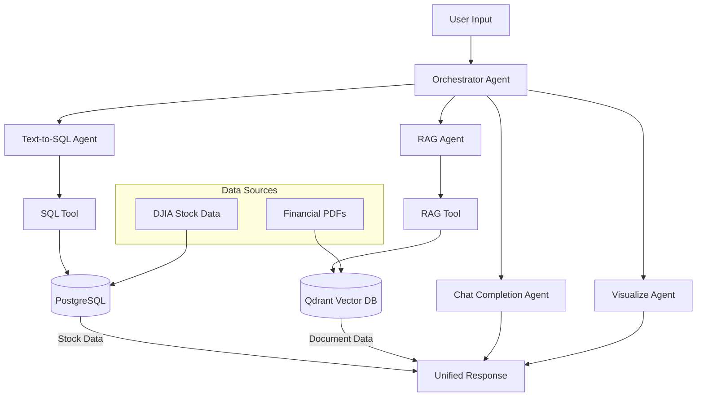

# Finance Agent System - Hệ thống AI Agent Tài chính Thông minh

Một hệ thống AI agent đa tác vụ sử dụng **Phidata Framework** để xử lý và phân tích dữ liệu tài chính thông qua **RAG (Retrieval-Augmented Generation)** với **Qdrant Vector Database** và **Text-to-SQL** với **PostgreSQL**. Hệ thống có thể xử lý các tài liệu PDF tài chính và truy vấn dữ liệu cổ phiếu từ các công ty DJIA.

## Mục Lục

- [Tổng Quan](#tổng-quan)
- [Kiến Trúc Hệ Thống](#kiến-trúc-hệ-thống)
- [Các Agent và Luồng Xử Lý](#các-agent-và-luồng-xử-lý)
- [Yêu Cầu Hệ Thống](#yêu-cầu-hệ-thống)
- [Cài Đặt và Thiết Lập](#cài-đặt-và-thiết-lập)
- [Chạy Ứng Dụng](#chạy-ứng-dụng)
- [Cấu Trúc Thư Mục](#cấu-trúc-thư-mục)
- [Luồng Xử Lý Chi Tiết](#luồng-xử-lý-chi-tiết)
- [API Endpoints](#api-endpoints)
- [Ví Dụ Sử Dụng](#ví-dụ-sử-dụng)
- [Testing](#testing)
- [Monitoring và Logging](#monitoring-và-logging)
- [Troubleshooting](#troubleshooting)
- [Đóng Góp](#đóng-góp)

## Tổng Quan

Hệ thống Finance Agent là một giải pháp AI toàn diện cho việc phân tích tài chính, bao gồm:

### Tính Năng Chính
- **Truy vấn dữ liệu cổ phiếu**: Tìm kiếm thông tin giá cổ phiếu, volume, P/E ratio của các công ty DJIA
- **Phân tích tài liệu tài chính**: Xử lý và tóm tắt báo cáo tài chính, báo cáo thường niên từ PDF  
- **Trực quan hóa dữ liệu**: Tạo biểu đồ, chart từ dữ liệu tài chính
- **Chat AI thông minh**: Trả lời câu hỏi tài chính dựa trên context từ database và documents
- **RESTful API**: Cung cấp API để tích hợp với các ứng dụng khác

### Trường Hợp Sử Dụng
- Phân tích hiệu suất cổ phiếu của các công ty cụ thể
- Tóm tắt nội dung báo cáo tài chính
- So sánh các chỉ số tài chính giữa các công ty
- Tạo insights từ dữ liệu lịch sử
- Trực quan hóa xu hướng thị trường

## Kiến Trúc Hệ Thống



### Các Thành Phần Chính

#### AI Agents
- **Orchestrator Agent**: Điều phối và quyết định agent nào sẽ xử lý truy vấn
- **Text-to-SQL Agent**: Chuyển đổi ngôn ngữ tự nhiên thành SQL queries
- **RAG Agent**: Tìm kiếm và tóm tắt thông tin từ documents
- **Chat Completion Agent**: Xử lý câu hỏi chung và tổng hợp kết quả
- **Visualize Agent**: Tạo code cho việc trực quan hóa dữ liệu

#### Tools & Infrastructure
- **CustomSQLTool**: Thực thi SQL queries trên PostgreSQL
- **CustomRAGTool**: Thực hiện semantic search trên Qdrant vector database
- **Groq API**: LLM backend cho tất cả agents
- **FastAPI**: Web framework cho API endpoints
- **Docker**: Containerization cho database services

## Các Agent và Luồng Xử Lý

### 1. **Orchestrator Agent** 
**Vai trò**: Master agent điều phối toàn bộ hệ thống
**Chức năng**:
- Phân tích ý định từ user queries
- Quyết định agent nào sẽ xử lý dựa trên keywords và context
- Tổng hợp kết quả từ các sub-agents
- Quản lý flow logic và error handling

**Luồng Xử Lý**:
```python
1. Nhận query từ user
2. Phân tích intent keywords:
   - Stock keywords → Text-to-SQL Agent
   - Document keywords → RAG Agent  
   - General questions → Chat Completion Agent
3. Gọi agent phù hợp
4. Tổng hợp và trả về kết quả cuối cùng
```

### 2. **Text-to-SQL Agent**
**Vai trò**: Chuyển đổi ngôn ngữ tự nhiên thành SQL queries
**Chức năng**:
- Parse user query để identify company, date range, metrics
- Chọn SQL template phù hợp từ visualized_template.yml
- Điền parameters vào template
- Tạo valid PostgreSQL queries

**Keywords**: `stock`, `price`, `volume`, `market cap`, `pe ratio`, `dividend yield`, `chart`, `plot`, `visualization`

**Ví dụ Flow**:
```python
Input: "Hiển thị giá cổ phiếu Apple từ tháng 1 đến tháng 6 2024"
1. Extract: company="Apple", date_range="2024-01-01 to 2024-06-30"
2. Match template: "time_series_price"  
3. Generate SQL: SELECT date, close_price FROM stock_prices WHERE ticker='AAPL' AND date BETWEEN '2024-01-01' AND '2024-06-30';
4. Execute via SQLTool
```

### 3. **RAG Agent**
**Vai trò**: Tìm kiếm và xử lý thông tin từ các tài liệu PDF tài chính
**Chức năng**:
- Tạo optimized sub-queries cho Qdrant search
- Identify company names từ user queries
- Thực hiện semantic similarity search trong vector database
- Tóm tắt và extract relevant information

**Keywords**: `report`, `annual report`, `financial statement`, `revenue`, `profit`, `balance sheet`

**Ví dụ Flow**:
```python
Input: "Tóm tắt phần doanh thu trong báo cáo thường niên của Apple"
1. Generate sub-query: "annual report revenue Apple"
2. Identify company: "Apple"
3. Search Qdrant với embedding của sub-query
4. Retrieve top-k relevant documents
5. Summarize revenue information từ documents
```

### 4. **Chat Completion Agent**  
**Vai trò**: Xử lý general queries và tổng hợp thông tin
**Chức năng**:
- Trả lời câu hỏi không được xử lý bởi SQL hoặc RAG
- Tổng hợp kết quả từ nhiều nguồn
- Cung cấp context và insights
- Xử lý conversational queries

**Keywords**: Tất cả queries không match với các agents khác

### 5. **Visualize Agent**
**Vai trò**: Tạo code cho việc trực quan hóa dữ liệu
**Chức năng**:
- Tạo Python code để tạo charts và plots
- Hỗ trợ nhiều loại visualization (bar, line, scatter, heatmap)
- Format data cho visualization libraries (matplotlib, seaborn)

## Yêu Cầu Hệ Thống

### Prerequisites
- **Python**: 3.10+
- **Docker & Docker Compose**: Phiên bản mới nhất
- **Memory**: Tối thiểu 8GB RAM (khuyến nghị 16GB)
- **Storage**: 5GB dung lượng trống

### API Keys Cần Thiết
- **Groq API Key**: [Đăng ký tại Groq Console](https://console.groq.com/)

### Docker Services
- **PostgreSQL**: Database cho stock data
- **Qdrant**: Vector database cho document search  

## Cài Đặt và Thiết Lập

### 1. Clone Repository
```bash
git clone <your-repo-url>
cd financial_agent_system
```

### 2. Tạo Virtual Environment
```bash
python -m venv venv
source venv/bin/activate  # Linux/Mac
# or
venv\Scripts\activate     # Windows
```

### 3. Cài Đặt Dependencies
```bash
pip install -r requirements.txt
```

### 4. Cấu Hình Environment
```bash
# Tạo .env file từ template
cp .env.example .env

# Chỉnh sửa .env và thêm API keys
nano .env
```

**Nội dung Environment file**:
```env
# API Configuration  
GROQ_API_KEY=your_groq_api_key_here
GROQ_MODEL=llama-3.1-8b-instant

# Database Configuration
POSTGRES_DB=financial_db
POSTGRES_USER=admin
POSTGRES_PASSWORD=password123
POSTGRES_HOST=localhost
POSTGRES_PORT=5432

# Qdrant Configuration
QDRANT_HOST=localhost
QDRANT_PORT=6333
QDRANT_COLLECTION=financial_documents
```

### 5. Khởi Động Database Services
```bash
# Start PostgreSQL và Qdrant
docker-compose up -d

# Kiểm tra trạng thái services
docker-compose ps
```

### 6. Khởi Tạo Database
```bash
# Tạo tables và schema
python scripts/init_db.py

# Download và populate DJIA companies data
python scripts/download_djia_companies.py
python scripts/download_djia_stock_prices.py
```

### 7. Populate RAG Documents
```bash
# Thêm PDF files vào data/rag_documents/
mkdir -p data/rag_documents
# Copy financial PDF files của bạn vào đây

# Populate vector database
python scripts/populate_rag.py
```

## Chạy Ứng Dụng

### Command Line Interface
```bash
python main.py
```

### Web API Server
```bash
# Start FastAPI server
python app.py
# hoặc
uvicorn app:app --host 0.0.0.0 --port 8000 --reload

# API có sẵn tại: http://localhost:8000
# Documentation tại: http://localhost:8000/docs
```

### Streamlit UI (Tùy chọn)
```bash
streamlit run ui.py
```

Truy cập Playground UI tại http://localhost:8000.

### Database Access
```bash
# Kết nối đến PostgreSQL:
psql -h localhost -U admin -d finance_db

# Password: admin
```

## Cấu Trúc Thư Mục

```
financial_agent_system/
│
├── README.md                      # Documentation
├── requirements.txt               # Python dependencies
├── docker-compose.yml            # Docker services config  
├── .env.example                  # Environment template
├── main.py                       # CLI entry point
├── app.py                        # FastAPI web server
├── ui.py                         # Streamlit interface
│
├── agents/                       # AI Agents
│   ├── orchestrator.py             #   Master orchestrator
│   ├── text_to_sql_agent.py        #   Natural language to SQL
│   ├── rag_agent.py                #   Document retrieval
│   ├── chat_completion_agent.py    #   General chat handler
│   └── visualize_agent.py          #   Data visualization
│
├── tools/                        # Agent Tools
│   ├── sql_tool.py                 #   PostgreSQL interface
│   └── rag_tool.py                 #   Qdrant interface
│
├── flow/                         # Processing Flows
│   ├── orchestrator_flow.py        #   Main orchestration logic
│   ├── sql_flow.py                 #   SQL execution flow
│   ├── rag_flow.py                 #   RAG processing flow
│   └── chat_completion_flow.py     #   Chat completion flow
│
├── config/                       # Configuration Files
│   ├── env.py                      #   Environment variables
│   ├── metadata_db.yml             #   Database schema
│   ├── visualized_template.yml     #   SQL templates
│   ├── chat_completion_config.yml  #   Chat agent config
│   └── ui_config.py                #   UI configuration
│
├── utils/                        # Utility Functions
│   ├── logging.py                  #   Logging setup
│   ├── response.py                 #   Response formatting
│   ├── response_parser.py          #   Response parsing
│   └── company_mapping.py          #   Company name mapping
│
├── data/                         # Data Storage
│   ├── rag_documents/              #   PDF documents for RAG
│   ├── djia_companies.csv          #   DJIA company list
│   └── stock_data/                 #   Historical stock data
│
├── scripts/                      # Setup Scripts
│   ├── init_db.py                  #   Database initialization
│   ├── download_djia_companies.py  #   Download company data
│   ├── download_djia_stock_prices.py# Download stock prices
│   └── populate_rag.py             #   Populate vector database
│
└── tests/                        # Test Suite
    ├── test_agents.py              #   Agent testing
    ├── test_tools.py               #   Tool testing
    └── test_flows.py               #   Flow testing
```

## Luồng Xử Lý Chi Tiết

### Main Orchestrator Flow

```python
def orchestrator_flow(query, orchestrator, sql_agent, sql_tool, rag_agent, rag_tool, chat_agent):
    """
    Luồng xử lý chính từ user query đến final response
    """
    
    # 1. Orchestrator phân tích query
    intent_analysis = orchestrator.run(query)
    
    # 2. Parse intent và routing decision  
    if should_use_sql(intent_analysis):
        # Text-to-SQL path
        sql_query = sql_agent.run(query)
        sql_result = sql_tool.execute(sql_query)
        return format_sql_response(sql_result)
        
    elif should_use_rag(intent_analysis):
        # RAG path
        rag_query = rag_agent.run(query)  
        rag_result = rag_tool.search(rag_query)
        return format_rag_response(rag_result)
        
    else:
        # General chat path
        chat_result = chat_agent.run(query)
        return format_chat_response(chat_result)
```

### Text-to-SQL Flow

```python
def sql_flow(query, sql_agent, sql_tool):
    """
    Luồng xử lý cho SQL queries
    """
    
    # 1. Agent phân tích query
    analysis = sql_agent.analyze_query(query)
    
    # 2. Extract metadata (company, date, metrics)
    metadata = extract_metadata(analysis)
    
    # 3. Chọn SQL template phù hợp
    template = select_sql_template(metadata.intent)
    
    # 4. Populate template với parameters
    sql_query = populate_template(template, metadata)
    
    # 5. Validate SQL syntax
    if not validate_sql(sql_query):
        return error_response("Invalid SQL generated")
    
    # 6. Execute query via SQL Tool
    result = sql_tool.execute(sql_query)
    
    # 7. Format và return results
    return format_sql_response(result, metadata)
```

### RAG Flow

```python  
def rag_flow(query, rag_agent, rag_tool):
    """
    Luồng xử lý cho document retrieval
    """
    
    # 1. RAG Agent tạo optimized sub-query
    rag_analysis = rag_agent.run(query)
    sub_query = rag_analysis.get('sub-query')
    company = rag_analysis.get('company')
    
    # 2. Search trong Qdrant vector database
    search_results = rag_tool.search(
        query=sub_query,
        company_filter=company,
        top_k=5
    )
    
    # 3. Extract relevant documents
    documents = [result.payload for result in search_results]
    
    # 4. Summarize và synthesize information
    summary = rag_agent.summarize(documents, query)
    
    # 5. Format và return results  
    return format_rag_response(summary, documents)
```

## API Endpoints

### FastAPI Endpoints

#### **POST** `/query`
Gửi query và nhận response từ hệ thống

**Request Body:**
```json
{
    "query": "Xu hướng giá cổ phiếu Apple trong năm 2024 như thế nào?",
    "options": {
        "stream": false,
        "include_metadata": true
    }
}
```

**Response:**
```json
{
    "status": "success",
    "message": "Giá cổ phiếu Apple cho thấy xu hướng tăng trong năm 2024...",
    "metadata": {
        "agent_used": "text_to_sql_agent",
        "execution_time": 1.2,
        "tokens_used": {
            "input": 50,
            "output": 150
        }
    },
    "data": {
        "chart_data": [...],
        "summary": "..."
    }
}
```

#### **POST** `/query/stream`
Streaming response cho real-time updates

#### **GET** `/health`
Health check endpoint

#### **GET** `/agents/status`  
Kiểm tra trạng thái của tất cả agents

## Ví Dụ Sử Dụng

### Stock Data Queries

```python
# Ví dụ 1: Giá cổ phiếu
query = "Hiển thị giá cổ phiếu Apple từ tháng 1 đến tháng 6 2024"
# → Text-to-SQL Agent xử lý
# → Tạo SQL query cho historical prices
# → Trả về data và visualization

# Ví dụ 2: So sánh nhiều cổ phiếu  
query = "So sánh hiệu suất cổ phiếu Microsoft và Apple trong Q1 2024"
# → SQL Agent tạo complex query để so sánh
# → Visualize Agent tạo comparative charts

# Ví dụ 3: Phân tích thị trường
query = "Cổ phiếu công nghệ nào có P/E ratio cao nhất?"
# → SQL query để filter và sort theo P/E ratio
# → Trả về ranked list với insights
```

### Document Queries

```python
# Ví dụ 1: Báo cáo tài chính
query = "Tóm tắt tăng trưởng doanh thu của Apple trong báo cáo thường niên mới nhất"
# → RAG Agent tìm kiếm Apple annual report
# → Extract các phần revenue
# → Tóm tắt growth trends

# Ví dụ 2: Chỉ số tài chính  
query = "Các chỉ số tài chính chính của Microsoft từ báo cáo 10-K là gì?"
# → RAG search trong Microsoft filings
# → Extract key metrics (revenue, profit, assets, etc.)
# → Structured summary

# Ví dụ 3: Phân tích chiến lược
query = "Chiến lược AI của Google được đề cập trong báo cáo nhà đầu tư như thế nào?"
# → Search cho AI-related content trong Google docs
# → Synthesizes strategy information
```

### General Queries

```python
# Ví dụ 1: Market insights
query = "Những yếu tố nào thường ảnh hưởng đến giá cổ phiếu công nghệ?"
# → Chat Completion Agent cung cấp general knowledge
# → Educational response về market factors

# Ví dụ 2: Investment advice
query = "Tôi có nên đầu tư vào các công ty DJIA ngay bây giờ không?"
# → Combination của current data + general guidance
# → Balanced response với disclaimers
```

## Testing

### Chạy Test Suite

```bash
# Tất cả tests
python -m pytest tests/ -v

# Test specific module
python -m pytest tests/test_agents.py -v
python -m pytest tests/test_tools.py -v  
python -m pytest tests/test_flows.py -v

# Test với coverage report
python -m pytest tests/ --cov=agents --cov=tools --cov=flow
```

### Test Categories

#### Agent Tests (`test_agents.py`)
- Test orchestrator intent classification
- Test SQL generation accuracy  
- Test RAG query optimization
- Test response formatting

#### Tool Tests (`test_tools.py`)
- Test database connections
- Test SQL execution
- Test Qdrant search functionality
- Test error handling

#### Flow Tests (`test_flows.py`)
- Test end-to-end query processing
- Test agent coordination
- Test error propagation
- Test response consistency

### Manual Testing

```bash
# Test CLI interface
python main.py

# Test queries:
Enter your query: Apple stock price 2024
Enter your query: Microsoft annual report revenue
Enter your query: exit
```

## Monitoring và Logging

### Hệ Thống Logging

Hệ thống sử dụng structured logging để theo dõi:

```python
# Log levels và content
DEBUG: Agent internal processing, SQL queries
INFO:  Request/response flow, execution time  
WARN:  Performance issues, fallback actions
ERROR: Failures, exceptions, invalid inputs

# Log format
[2024-01-15 10:30:45] [INFO] [orchestrator] Query processed: "Apple stock" → text_to_sql_agent (1.2s)
[2024-01-15 10:30:46] [DEBUG] [sql_agent] Generated SQL: SELECT * FROM stock_prices WHERE ticker='AAPL'
[2024-01-15 10:30:47] [INFO] [sql_tool] Query executed successfully (0.3s, 150 rows)
```

### Metrics Tracking

- **Token Usage**: Input/output tokens per agent call
- **Response Time**: End-to-end và per-component timing  
- **Success Rate**: Query completion percentage
- **Agent Usage**: Frequency distribution của agent calls
- **Error Rate**: Failure patterns và root causes

### Debug Mode

```bash
# Enable debug logging
export LOG_LEVEL=DEBUG
python main.py

# Hoặc trong code
import logging
logging.getLogger().setLevel(logging.DEBUG)
```

## Troubleshooting

### Các Vấn Đề Thường Gặp

#### Database Connection Issues
```bash
# Kiểm tra PostgreSQL status
docker-compose ps postgres

# Restart services
docker-compose restart postgres

# Check logs
docker-compose logs postgres
```

#### Qdrant Connection Issues
```bash
# Kiểm tra Qdrant status  
curl http://localhost:6333/health

# Restart Qdrant
docker-compose restart qdrant

# Re-populate nếu cần
python scripts/populate_rag.py
```

#### API Key Issues
```bash
# Verify Groq API key
export GROQ_API_KEY=your_key
python -c "from config.env import GROQ_API_KEY; print('API Key loaded' if GROQ_API_KEY else 'API Key missing')"
```

#### Agent Response Issues
```bash
# Test individual agents
python -c "
from agents.text_to_sql_agent import create_text_to_sql_agent
agent = create_text_to_sql_agent()  
print(agent.run('Apple stock price'))
"
```

### Error Handling

Hệ thống có comprehensive error handling:

- **Graceful Degradation**: Nếu một agent fail, system sẽ fallback
- **Retry Logic**: Automatic retry cho transient failures
- **Error Messages**: User-friendly error explanations
- **Logging**: Detailed error tracking cho debugging

### Recovery Procedures

```bash
# Full system reset
docker-compose down
docker-compose up -d
python scripts/init_db.py
python scripts/populate_rag.py

# Clear logs và restart
rm -f logs/*.log
python main.py
```

## Đóng Góp

### Contributing Guidelines

1. **Fork** repository
2. **Tạo** feature branch: `git checkout -b feature/new-agent`
3. **Thực hiện** changes và add tests
4. **Đảm bảo** tất cả tests pass: `pytest tests/`
5. **Submit** pull request với clear description

### Development Setup

```bash
# Install development dependencies
pip install -r requirements-dev.txt

# Setup pre-commit hooks
pre-commit install

# Run code quality checks
black agents/ tools/ flow/
flake8 agents/ tools/ flow/
mypy agents/ tools/ flow/
```

### Các Lĩnh Vực Để Đóng Góp

- **New Agents**: Thêm specialized agents (e.g., sentiment analysis, portfolio optimization)
- **Enhanced Tools**: Cải thiện database tools, thêm new data sources
- **UI/UX**: Enhance Streamlit interface, add web dashboard
- **Performance**: Optimize query processing, caching mechanisms  
- **Documentation**: Cải thiện docs, add tutorials
- **Testing**: Expand test coverage, add integration tests

---

## License

Dự án này được phát hành dưới [MIT License](LICENSE).

---

**Cảm ơn bạn đã sử dụng Finance Agent System!**

*Nếu bạn thấy dự án này hữu ích, vui lòng xem xét việc give it a star!*

